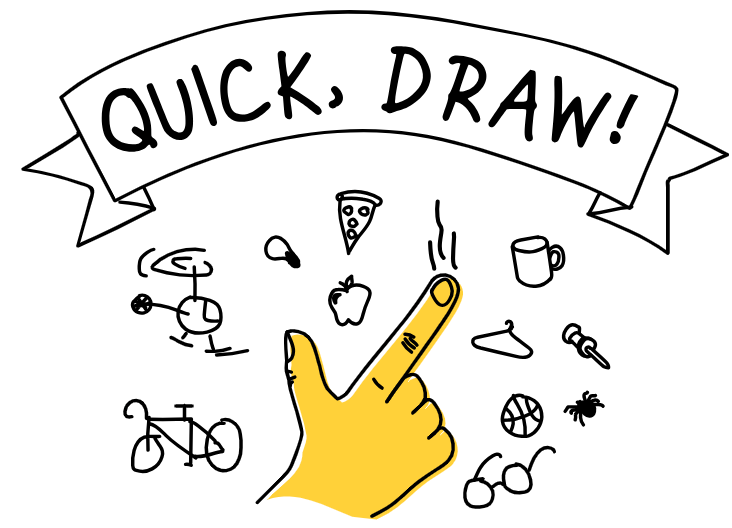

# Quick Draw Lab

[Quick Draw](https://quickdraw.withgoogle.com/) is a fun game that can be played by anyone who can use a mouse. It is a machine-learning web application that will try to guess what you are drawing.  It is a great way to introduce kids to machine learning and prediction.

QuickDraw is similar to the game Pictionary in that the player only has a limited time to draw and item.  But in this case, the computer is trying to guess what you are drawing.

QuickDraw was created by the engineers at Google and is kid-safe.  It is free and does not gather and store any personal information.

## How it Works

QuickDraw will suggest an item to draw such as "bicycle".  You then have 20 seconds to draw that item while an AI agent will try to guess what you are drawing.  This repeats six times.  At the end of the game Quick

## Steps

Have kids play one or more rounds of QuickDraw.  Then ask some questions:

1.  How long did it take QuickDraw to guess what you were trying to draw?
2.  How good was it at guessing?
3.  Were all the drawing the same level of difficulty to draw?
4.  How many items do you think it was comparing your drawing with?
5.  How do you think QuickDraw "learned" to match drawings and the names of items?
6.  How is "prediction" involved in QuickDraw?
7.  Could QuickDraw give you detailed explanations of why it guessed specific items?
8.  When is it important for an AI to give you explanations of why it has made a decision?  Is explainable AI important if healthcare?
9.  What is "similarity" in the context of QuickDraw?
10. Look at the [data](https://quickdraw.withgoogle.com/data) used to train QuickDraw.  What did you learn from this data?
11. Look at the [categories](https://github.com/googlecreativelab/quickdraw-dataset/blob/master/categories.txt) of items.  Is this list of items biased in any way?  Are insects fairly represented?
12. If you had to write your own version of QuickDraw, how would you go about doing it?

## More to Explore

If your class has some experience with Python, have them do a search for "Quick, Draw" on GitHub.  What do you find?

## References

* [Anubhav Shrimal's GitHub repo](https://github.com/anubhavshrimal/Quick-Draw)
* [Chandra Kanth GitHub repo](https://github.com/ck090/Google_Quick_Draw)
* [Machine Learning on Wikipedia](https://en.wikipedia.org/wiki/Machine_learning)
* [Explainable AI on Wikipedia](https://en.wikipedia.org/wiki/Explainable_artificial_intelligence)

