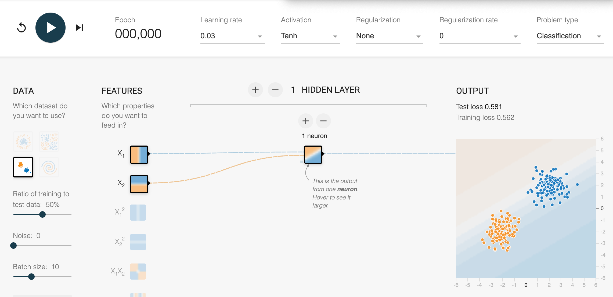
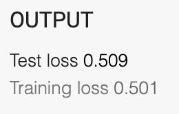
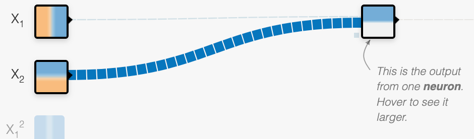

# TensorFlow Playground

In this lab, we will use the Google TensorFlow Playground web application to build very small neural networks.  Our goal is to get a high-level feeling of what neural networks are and how they transform data in layers.

The TensorFlow Playground web application is here:

[https://playground.tensorflow.org/](https://playground.tensorflow.org/)

## Starting Simple

The best way to start this class is to start with a very simple dataset and see if we can create a simple neural network to determine if an item is in one of two classifications.  Once we understand this process, we will make the datasets more complicated and also increase the complexity of the neural network.

## Basic Concepts

1. Training Data - data we build the neural network with
2. Test Data - data we evaluate how good our neural network is
3. The Ratio of Train to Test - the relative size of the data sets.  The default ratio is 50%
4. Epoch - one complete pass through all the training data

## A Simplified User Interface

[Simplified UI With Just the Step UI](https://playground.tensorflow.org/#activation=linear&batchSize=10&dataset=gauss&regDataset=reg-plane&learningRate=0.03&regularizationRate=0&noise=5&networkShape=1&seed=0.07855&showTestData=false&discretize=true&percTrainData=50&x=true&y=true&xTimesY=false&xSquared=false&ySquared=false&cosX=false&sinX=false&cosY=false&sinY=false&collectStats=false&problem=classification&initZero=false&hideText=false&showTestData_hide=true&stepButton_hide=false&activation_hide=true&problem_hide=true&noise_hide=true&discretize_hide=true&resetButton_hide=true&regularization_hide=true&dataset_hide=true&batchSize_hide=true&playButton_hide=true&learningRate_hide=true&regularizationRate_hide=true&percTrainData_hide=true&numHiddenLayers_hide=true)

## Single Neuron

Click the "Reset the Network" button in the upper left corner:

Note what test loss and training loss are after you do this:

This says you are getting a 50% chance of getting the answers correct.

Change the weight of the second link to be 10.  You should see the width of the line get much larger:

Press the Step button and note the change in the Output:

### Single Exercise

1. How many steps does it take for the "Test loss" to drop below 0.01?
2. Regenerate the initial values several times.  How do the initial values impace the speed to lower the loss function?
3. Turn the noise up to 10.  What happens when the data is "dirty"?
4. Click the "show test data" button.

